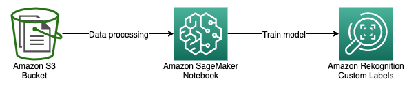
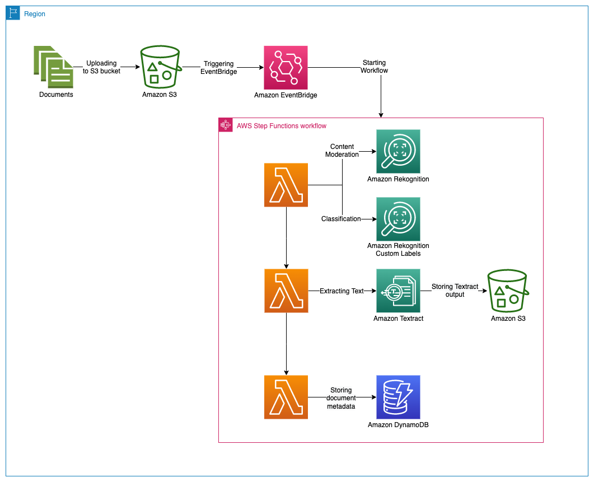

# Moderating, Classifying and Processing Documents using Amazon Rekognition and Amazon Textract

## Summary
This scalable, secure and automated solution allows users to moderate, classifyand process documents using Amazon Rekognition, Custom Labels and Amazon Textract. It allows faster document processing, higher accuracy and reducing the complexity of data extraction. It also provides better security and compliance with personal data legislation by reducing the human workforce involved in processing incoming document.

The solution has two components: 1. Training Pipeline where we will train a model using Amazon Rekognition Custom Labels to classify documents and 2. Inference Pipeline where we will moderate, classify (using the model trained and deployed in the training pipeline) and process documents.

## Training Pipeline
In the training pipeline, we will label the documents using Amazon SageMaker GroundTruth. We then will use the labeled documents to train a model with Amazon Rekognition Custom Labels.

### Installation
The following Cloudformation templates will deploy the training pipeline.

Region| Launch
------|-----
US East (N. Virginia) | 
US West (Oregon) | 

Once the CloudFormation stack has been created, navigate to Amazon SageMaker Console. Click on Notebook instances from the pane on the left. Look for an instance with name **DocProcessingNotebookInstance-** prefix and wait till the status is *InService*. Under Actions, click on *Open Jupyter*. Click on the ***Rekognition_Custom_Labels.ipynb*** notebook.

The notebook demonstrates entire lifecycle of preparing training and test images, labeling them, creating manifest files and training a model with Amazon Rekognition Custom Labels. The notebook is self-explanatory; you can follow the steps to complete training the model.

## Inference Pipeline

In the inference pipeline, we will:
1. Perform moderation on uploaded documents using Amazon Rekognition.
2. Classify documents into different categories such as W-2s, invoices, bank statements, pay stubs using Amazon Rekognition Custom Labels.
3. Extract text from documents such as printed text, handwriting, forms, and tables using Amazon Textract.
4. Store meta-data (moderation and classification labels) in to Amazon DynamoDB table.

### Installation
The following Cloudformation templates will deploy the inference pipeline.

Region| Launch
------|-----
US East (N. Virginia) | 
US West (Oregon) | 

Once the CloudFormation stack has been created, you are ready to use the solution and process a document. Navigate to Amazon S3 console and find the input S3 bucket. Click on **Create folder** button and enter ***inputDocuments*** and click Create folder. Upload a sample document into the S3 folder.

This starts the workflow. The process will populate the DynamoDB table with document classification and moderation labels. The output from Amazon Textract will be delivered to the output S3 bucket inside TextractOutput folder.

## Clean-up
You can complete the following steps to clean up resources deployed for this solution.
1.	On the CloudFormation console, choose Stacks.
2.	Select the stacks deployed for this solution.
3.	Choose Delete.

These steps will not delete the S3 buckets, DynamoDB table and the trained Amazon Rekognition Custom Labels model. You will continue to incur storage charges if they are not deleted. You should delete these resources directly from the service console if you no longer need them.

# Security

See [CONTRIBUTING](CONTRIBUTING.md#security-issue-notifications) for more information.

# License

This library is licensed under the MIT-0 License. See the LICENSE file.
